<div align="center">
  
</div>

---

```python
whoami = {
    "name"    : "Mirac Kayıkçı",
    "focus"   : ["cybersecurity", "python", "web pentesting"],
    "status"  : "learning to break things — legally.",
    "pronouns": "he/him"
}
```

---

<div align="center">


</div>

---

<div align="center">

```
linkedin → www.linkedin.com/in/mirackayikci
```

</div>
